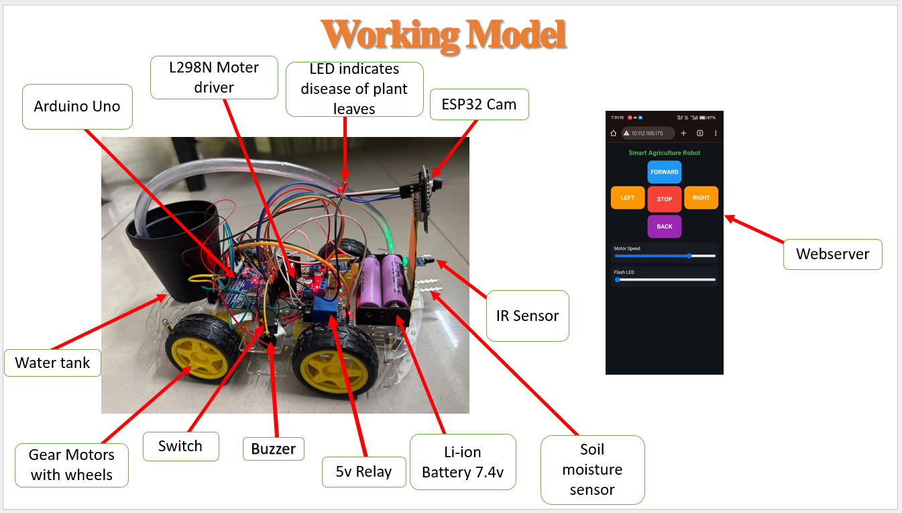
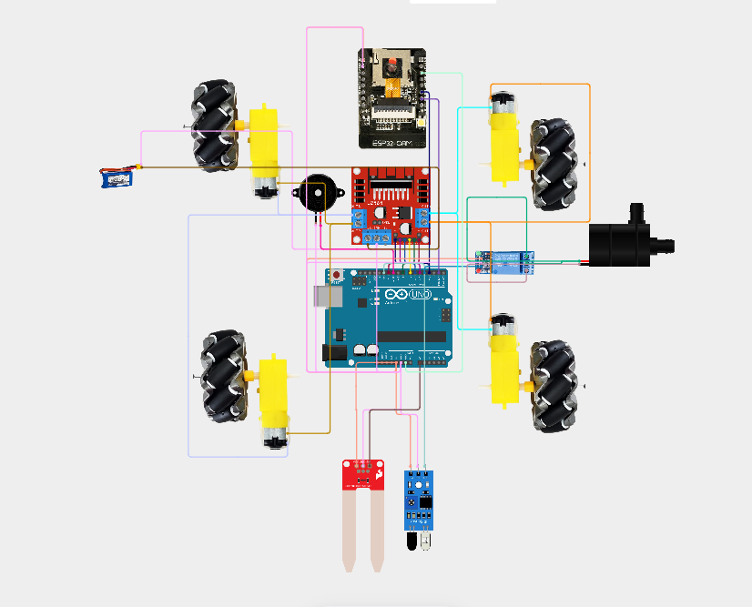
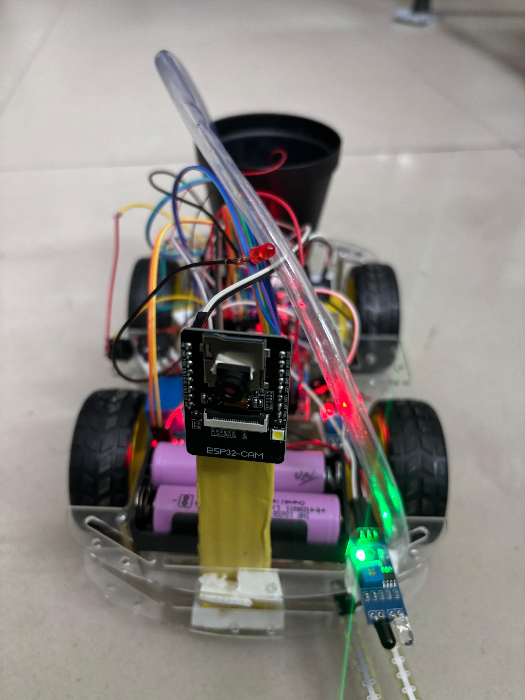
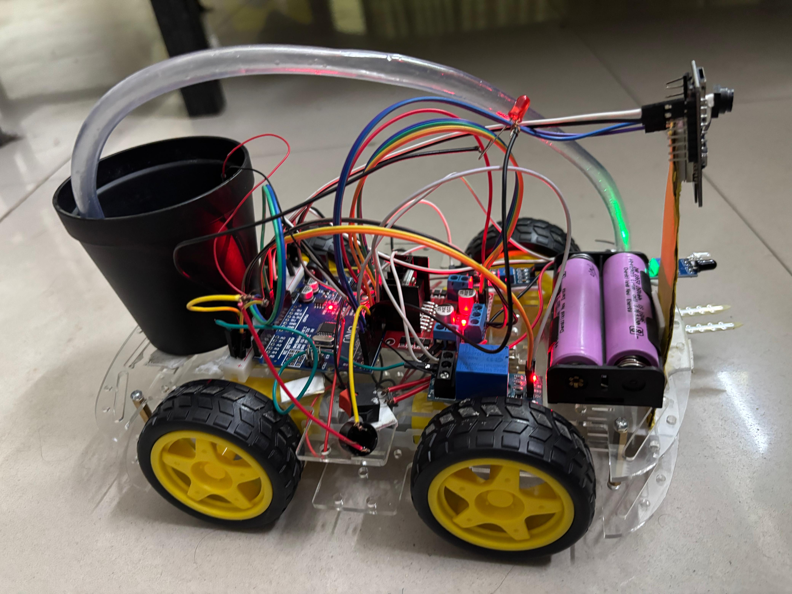
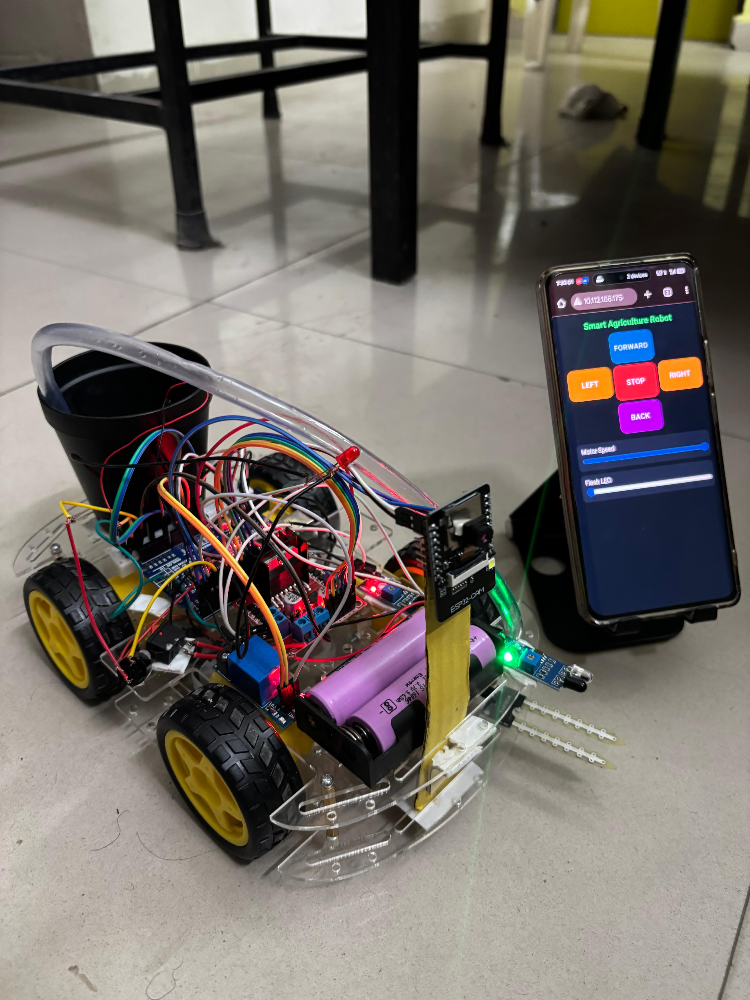
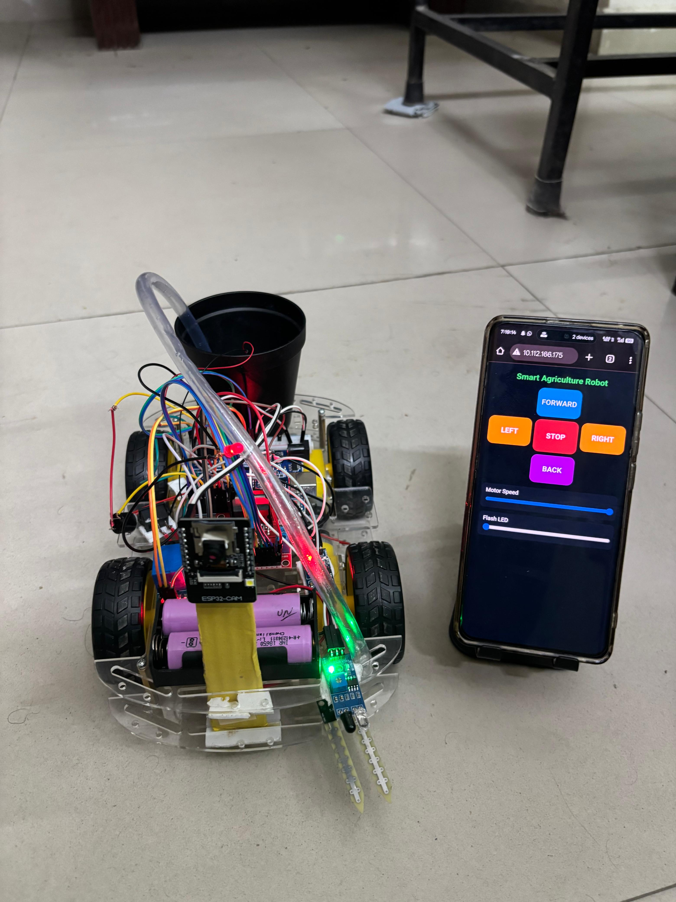

## AgroRover X

An IoT-based smart agriculture robot prototype designed for crop monitoring, obstacle detection, soil moisture management, and future AI-powered plant disease detection.

---

## Project Overview

AgroRover X is an autonomous and web-controlled agricultural robot built using an **ESP32-CAM** and an **Arduino Uno**. It combines remote mobility, real-time environmental sensing, automated irrigation, and a simulation framework for future plant pathology diagnostics.

## Working Model Overview

> **Important Disease Detection Note:** The actual AI/ML-based crop leaf disease detection could not be implemented in the current version due to module limitations during prototype development. Instead, a buzzer and blinking LED are used as a **fake demonstration indication** to simulate a future disease alert workflow.

---

## Key Features

- **Wi-Fi-Based Web Control:** Access a clean HTML/JavaScript control interface hosted by the ESP32-CAM.
- **Full Mobility:** Forward, backward, left, right, and stop controls with a dedicated motor speed slider.
- **Smart Irrigation:** Real-time soil moisture monitoring with automatic and manual water pump control modes.
- **Obstacle & Reverse Alerts:** IR-based obstacle detection coupled with reverse buzzer alerts.
- **Simulated Disease Indicator:** Blinking LED and buzzer demo behavior triggered during reverse movement.
- **Hardware Integration:** Dual-controller architecture separating web handling from motor/sensor processing.

---

## Controller Responsibilities

### ESP32-CAM AI Thinker
- Connects to local Wi-Fi and hosts the web control server.
- Transmits directional movement commands and motor speed values.
- Manages flash LED brightness via a web slider.
- Communicates serial commands to the Arduino Uno.

### Arduino Uno
- Drives DC motors via the L298N motor driver.
- Reads data from the IR obstacle sensor and soil moisture sensor.
- Manages the water pump relay, buzzer, and fake disease LED.
- Executes automated watering logic during **Automatic Mode**.

---

## System Demonstration Behaviors

### 1. Reverse Detection Demo
When the robot moves backward and the IR sensor encounters an object:
1. The sensor triggers an obstruction state.
2. The buzzer produces a *beep-beep* sound.
3. The fake disease LED starts blinking.
4. *Note:* This is purely a prototype demonstration feature and does not confirm actual plant disease.

### 2. Automatic Mode Logic
1. The robot moves forward through the field.
2. The IR sensor detects an object/boundary and stops the robot.
3. The soil moisture sensor checks the hydration level of the soil.
4. If the soil is dry, the water pump automatically turns on.
5. After watering completes, the robot resumes its standard operation.

---

## Serial Command Reference

| Command | Function |
| :--- | :--- |
| `F` | Move Forward |
| `B` | Move Backward |
| `L` | Turn Left |
| `R` | Turn Right |
| `S` | Stop Movement |
| `SPEED:value` | Change motor speed |
| `PUMP_ON` | Turn water pump on |
| `PUMP_OFF` | Turn water pump off |
| `AUTO` | Start automatic mode |
| `MANUAL` | Start manual mode |
| `BUZZER_ON` | Turn buzzer on |
| `BUZZER_OFF` | Turn buzzer off |
| `LIGHT_ON` | Turn flash light on |
| `LIGHT_OFF` | Turn flash light off |

---

## Hardware Components

- ESP32-CAM AI Thinker
- Arduino Uno
- L298N motor driver
- DC motors & Robot wheels
- IR obstacle sensor
- Soil moisture sensor
- Water pump & Water pipe
- Relay module
- Buzzer
- LED indicator
- Battery pack & Jumper wires

---

## Software & Repository Structure

- **Firmware:** Arduino Uno firmware & ESP32-CAM web control server scripts.
- **Interface:** HTML and JavaScript control dashboard.

AgroRover-X/
├── README.md
├── wiring_diagram.md
├── esp32_cam/
│   └── AgroRover_ESP32_CAM.ino
├── arduino_uno/
│   └── AgroRover_Arduino_Uno.ino
└── assets/

## Future Scope

Implementation of real-time crop leaf disease classification using advanced machine learning models (AI/ML).

Integration of cloud-based storage for capturing and reviewing plant health images over time.

Addition of GPS modules for automated field navigation and mapping.

Development of a dedicated mobile application for remote monitoring outside local Wi-Fi range.

### Project Team & Author
- **Lead Developer & Creator:** Ashish Kumar Rana (Full Code & Implementation)
- **Team Members:** Akhilesh, Karan, Purushotham

License: Created for 2nd semester college educational and prototyping purposes.
## Circuit Diagram

 

## Other Views

- **Front View:**

- **Side View:**

- **Side View with Mobile:**

- **Mobile View Interface:**

